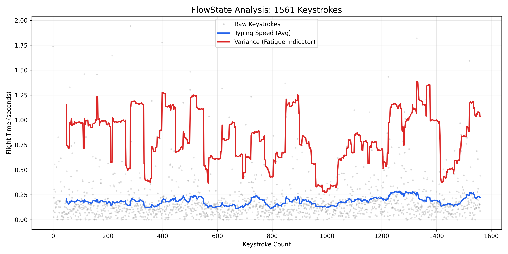

# FlowState: Non-Invasive Cognitive Load Estimation 🧠

> **A Privacy-First Affective Computing System using Keystroke Dynamics.**


*(Figure 1: Visualization of Typing Rhythm Variance (Red) correlating with Cognitive Fatigue)*

## 🔬 Research Abstract
Standard productivity tools (Pomodoro, Time-Trackers) rely on arbitrary fixed intervals, often interrupting "Flow" states or failing to detect genuine burnout. **FlowState** is a background research agent that uses **Keystroke Dynamics**—the biometric timing between key press and release—to estimate cognitive load in real-time.

By training an **Isolation Forest** (Unsupervised Learning) on a user's baseline typing patterns, the system detects deviations in **Flight Time Variance** and **Dwell Time**, signaling the onset of mental fatigue without sending any private data to the cloud.

## 🚀 Key Features
* **Privacy-First:** All processing happens locally. No text is ever recorded—only the *timing* between keys.
* **Adaptive Baseline:** Uses an Isolation Forest to learn *your* specific "Normal," adapting to your typing style.
* **Calm Technology:** Operates invisibly in the background, intervening only when statistical anomalies (fatigue) are detected.

## 🛠️ Tech Stack
* **Language:** Python 3.10+
* **Machine Learning:** Scikit-Learn (Isolation Forest)
* **Data Processing:** Pandas, NumPy
* **Input Monitoring:** Pynput (Hooks for low-level hardware interrupts)

## 📂 Project Structure
```
flowstate/
├── src/
│   ├── logger.py       # Data Collection: Captures raw flight-time metrics
│   ├── train_model.py  # The Teacher: Trains the Isolation Forest on your logs
│   ├── inference.py    # The Brain: Modular class for real-time prediction
│   └── live_monitor.py # The App: Real-time background agent
├── notebooks/
│   └── exploration.ipynb # Data Visualization & Feature Engineering proof
├── data/               # (GitIgnored) Local storage for privacy
└── requirements.txt    # Dependencies
```
⚡ Quick Start
1. Installation:
```

git clone https://github.com/charu2210/FlowState.git
cd FlowState
pip install -r requirements.txt
```
2. Phase 1: Data Collection (Calibration)
Run the logger in the background while you work/study for 15-20 minutes to establish a baseline.

```
python src/logger.py
```
3. Phase 2: Training
Train the anomaly detector on the data you just collected.

```
python src/train_model.py
```
Output: ✅ Model saved successfully to src/flowstate_model.pkl

4. Phase 3: Live Deployment
Start the real-time monitor. It will silently watch your rhythm and alert you if you show signs of fatigue.

```
python src/live_monitor.py
```
📊 The Science: Why it works
According to the Yerkes-Dodson Law, performance improves with arousal up to a point, after which it drops. In typing, this drop manifests as:

1. Increased Flight Time Variance: The rhythm becomes "jagged."
2. Micro-Pauses: Unconscious delays between familiar bigrams.

FlowState detects these micro-deviations that are invisible to the naked eye but statistically significant to the model.

🔮 Future Roadmap
* Integration with OpenCV for Blink Rate detection (Multimodal Analysis).
* Migration of the inference engine to C++ for lower memory footprint.
* "Grayscale Mode" trigger to gently nudge users to take a break.

📜 License
MIT License - Open for Academic and Personal Use

